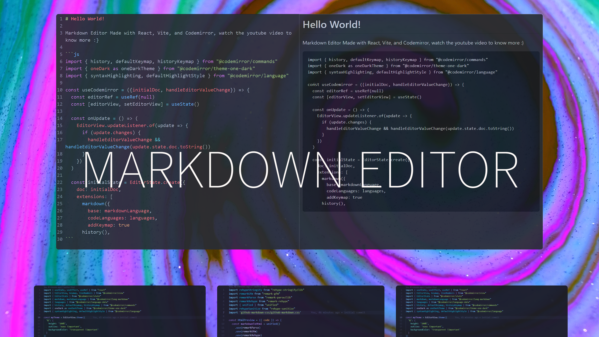

# Markdown Editor

## Video

Made with React, Vite, and Codemirror, watch the youtube video to know more:

[](https://www.youtube.com/watch?v=iqH62Q7otJw)


## Install

```bash
yarn install
```

**Run:**

```bash
yarn dev
```

## Project structure

```
MARKDOWN_EDITOR
│   # Static files
├── public/
│   # Base
├── src/
    |   # React component files
    ├── components/
    |   # Codemirror functionality
    ├── hooks/
    |   # Aplication
    ├── App.jsx
|   # Main HTML
├── index.html
```

## Stack

* [Vite](https://vitejs.dev/):  It's a build tool that aims to provide a faster and leaner development experience for modern web projects.
* [React](https://reactjs.org/): A JavaScript library for building user interfaces
* [Codemirror](https://codemirror.net/): Code editor component for the web
* [Unified](https://unifiedjs.com/): Compiles content to syntax trees and syntax trees to content.
* [Remark](https://remark.js.org/): Markdown processor powered by plugins.

### Latest Project

Markdown Web Editor => [MarkWriter](https://markwriter.tech/)

---

### License

MIT Licence